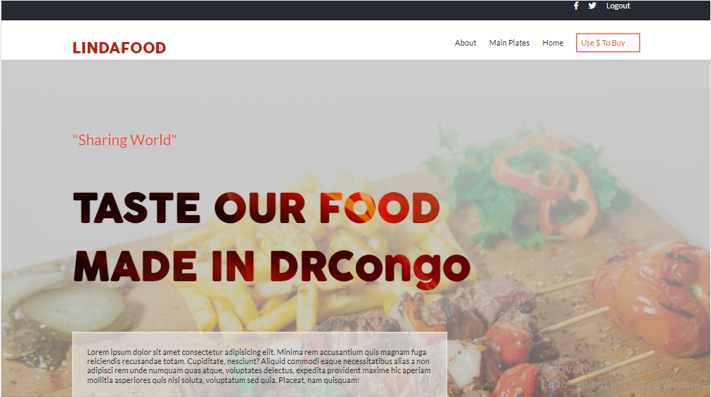

# *LINDA TASTE FOOD*

 *>This project is related to the completion of the Portal module*

[Online Version](https://keza681.github.io/) deployed on github pages.

## Built With

 Major languages
- HTML
- CSS
- JAVASCRIPT

## Author

👤 **Keza**

- GitHub: [Visit my github](https://github.com/keza681)
- Twitter: [Visit my twitter](https://twitter.com/LKeza19)
- LinkedIn: [Linkedin Profile](https://www.linkedin.com/in/linda-keza-a10150218/)

## 🤝 Contributing

Contributions, issues, and feature requests are welcome😉

Feel free to check the [issues page](https://github.com/keza681/LindaFood-Project/issues).

## Show your support

Leave a ⭐️ if you like this project!

## Acknowledgments

- The [design](https://www.behance.net/gallery/29845175/CC-Global-Summit-2015) is originally created by [@Cindy Shin](https://www.behance.net/adagio07) with an open [license](https://creativecommons.org/licenses/by-nc/4.0/) of NonCommercial use. Some modifications has been made to fit the needed requirment of the project. This project is designed as an assignment for my school and not for commercial use.

- Hat tip to anyone whose code was used

## 📝 License

This project is [MIT](./MIT.md) licensed
